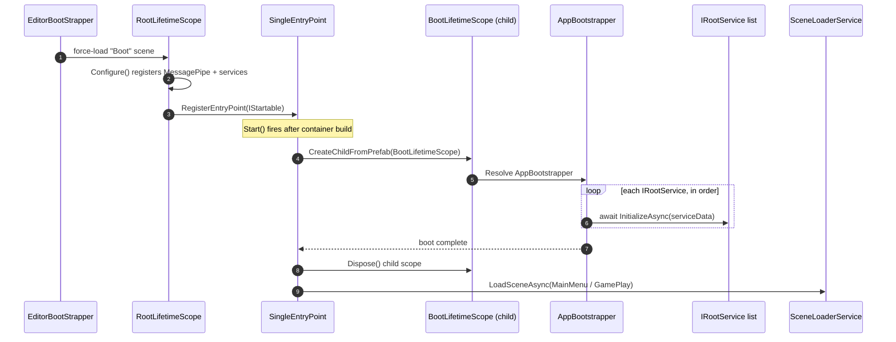
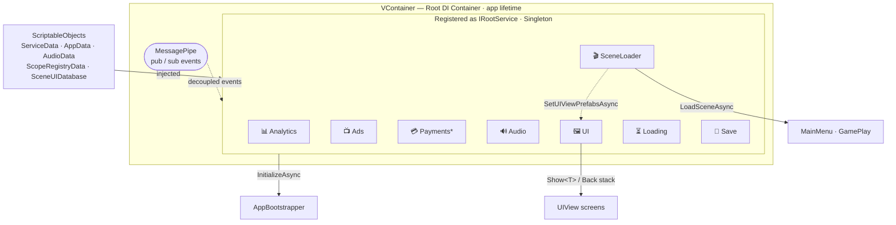

# 🧩 Mudit Core

> A production-ready **mobile game framework** for Unity 6 LTS — boot, services, UI, and saves wired up so you can start building the *game*, not the plumbing.

<p align="center">
  
  
  
  
  
</p>

---

## ✨ What you get

| | Service | What it does |
|---|---|---|
| 📊 | **Analytics** | Firebase event tracking |
| 📺 | **Ads** | IronSource LevelPlay (banner, interstitial, rewarded) |
| 💳 | **Payments** | Platform IAP (Android / iOS / Mock) |
| 🔊 | **Audio** | Crossfade music + pooled SFX |
| 🖼️ | **UI** | Stack-based views with fade & overlay support |
| 🎬 | **Scenes** | Async scene loading with loading screen |
| 💾 | **Save** | Encrypted · compressed · plain modes |

All powered by **VContainer** (DI), **MessagePipe** (events), **UniTask** (async), and **UniRx** (reactive state).

---

## 🚀 Boot Flow

```
Boot scene  ─►  RootLifetimeScope        register every service
            ─►  AppBootstrapper          InitializeAsync() each service, in order
            ─►  MainMenu / GamePlay       your game starts here
```

> One entry point. Every service lives for the whole app lifetime — no singletons, everything injected.

---

## 🔍 Under the Hood

### Runtime boot sequence



### How the pieces connect



> **\* Payments** swaps implementation at compile time — `AndroidPaymentService`, `IOSPaymentService`, or `MockPaymentService` (editor) — all behind the same `IPaymentService`.
> Each service can be toggled off via a checkbox on `RootLifetimeScope` (`isAdsEnabled`, `isAudioEnabled`, …).

---

## 🧱 Architecture at a glance

```
Assets/Core/
├── Runtime/
│   ├── Boot/             ← bootstrapper + entry point
│   ├── LifetimeScopes/   ← DI registration (Root / Boot)
│   ├── Interfaces/       ← IRootService contracts
│   ├── Services/         ← Analytics, Ads, Audio, UI, Save, …
│   ├── ScriptableObjects/← config data (ServiceData, AppData, …)
│   └── UI/               ← UIView base + helpers
└── Samples~/            ← starter scenes, prefabs & demo views
```

---

## 🔌 Add your own service in 3 steps

```csharp
// 1. Contract
public interface IMyService : IRootService { }

// 2. Implementation
public class MyService : IMyService
{
    public UniTask InitializeAsync(ServiceData settings) => UniTask.CompletedTask;
}

// 3. Register in RootLifetimeScope.Configure()
builder.Register<IMyService, MyService>(Lifetime.Singleton);
```

---

## ⚙️ Configure everything from `Create ▸ Mudit ▸ …`

`ServiceData` · `AppData` · `AudioData` · `ScopeRegistryData` · `SceneUIDatabase` — drop in your keys, clips, scenes, and UI prefabs. No code required.

---

